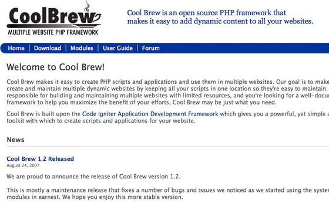
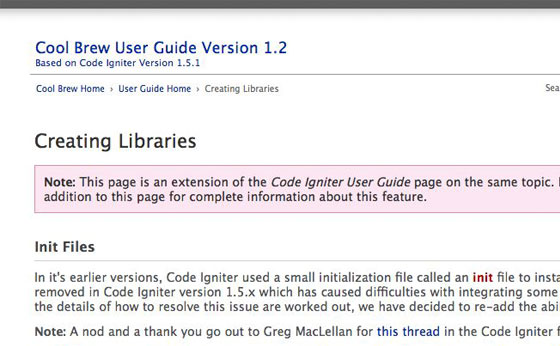
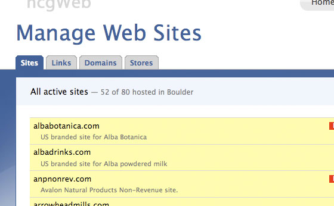
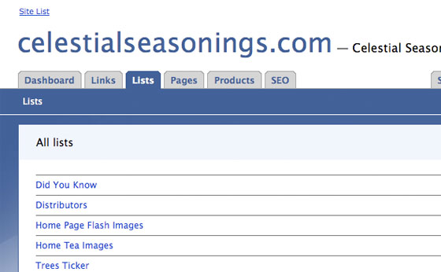

# Coolbrew Framework/CMS

Coolbrew is an open-source PHP framework that makes it easy to add dynamic content to all your websites.

Coolbrew was built for use with static websites and uses a tag-based architecture. The idea is that you can create dynamic parts for your website (or multiple websites) in Coolbrew and inject them into a static website using simple PHP functions calls that return HTML. In that way, they're similar in concept to Wordpress Shortcodes.

This framework is no longer in use. It was replaced by Wordpress and other CMSs that provided much of the same functionality. It's presented here as a code base for anyone interested in creating something similar. To get into the weeds, you can look at the code and/or [browse the full documentation.](https://jimappleg8.github.io/coolbrew/)

## Project Goals

The goal with this new framework was to create the next generation of [hcgPublic](https://github.com/jimappleg8/hcgpublic/). I had continued to look, but I was unable to find an existing CMS that would do what I needed with multiple sites, so I determined that I needed to build my own. I chose to base it on CodeIgniter because it was lightweight and well structured.

## Modules

I wrote a number of modules for CoolBrew including products, store locator, Active Directory search, site administration, SEO tools, recipes, contests, job listings, lists, mailform, and pages. At its peak, the system ran as many as 20 websites from a single code base.

## Screen Shots

---

---

---

